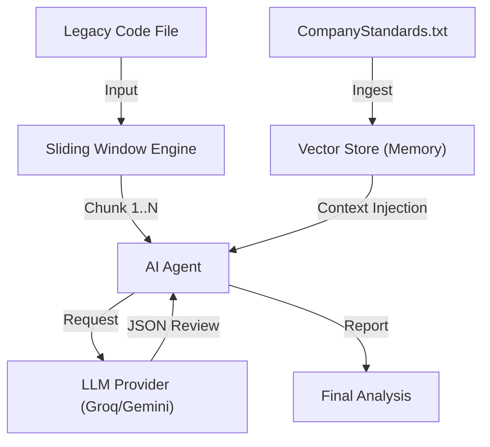

# 🛡️ AI Code Reviewer Agent

[](https://www.oracle.com/java/)
[](https://github.com/langchain4j/langchain4j)
[](https://en.wikipedia.org/wiki/Retrieval-augmented_generation)

A professional-grade **AI Code Review Agent** built in Java. It automates code analysis against proprietary organizational standards using a **Retrieval-Augmented Generation (RAG)** architecture. 

Designed for **Enterprise Environments**, it features a sliding window engine for processing legacy monolithic files and a model-agnostic design (Google Gemini + Groq).

---

## 🏗️ Architecture

The application follows a **Clean Architecture** pattern, decoupling the AI service layer from business logic.



---

## 🚀 Key Features

1.  **🧠 RAG-Powered Compliance:** Ingests a custom `CompanyStandards.txt` rulebook to enforce specific internal guidelines (e.g., "Always use Loggers," "Snake_case variables") rather than generic advice.
2.  **🪟 Sliding Window Engine:** Uses a custom **Deque-based algorithm** to process large files (>10,000 lines) by segmenting context into overlapping chunks, preventing LLM context window overflow.
3.  **⚡ Hybrid AI Model:** Optimizes cost and speed by using **Google Gemini** for Vector Embeddings and **Groq (Llama 3.3)** for high-speed inference.

---

## 🛠️ Project Structure

```text
src/main
├── java/org/example/reviewer
│   ├── AgentFactory.java        # Wires RAG, Embeddings, and Chat Models
│   ├── App.java                 # Main Entry Point
│   ├── CodeAnalysis.java        # Java Record (Data Model)
│   └── SlidingWindowEngine.java # Algorithmic Logic for large files
└── resources
    ├── CompanyStandards.txt     # Your custom coding rules
    └── BadCode.java             # Test file for analysis
```

---

## ⚙️ Step-by-Step Setup

### Step 1: Prerequisites
* **Java 21 (JDK)**
* **Maven 3.x**
* **API Keys:**
    * [Google AI Studio](https://aistudio.google.com/) (Free) - For Embeddings.
    * [Groq Console](https://console.groq.com/) (Free) - For Llama 3 Inference.

### Step 2: Dependencies (`pom.xml`)
Add the following LangChain4j dependencies to your `pom.xml` file:

```xml
<dependencies>
    <dependency>
        <groupId>dev.langchain4j</groupId>
        <artifactId>langchain4j</artifactId>
        <version>0.35.0</version>
    </dependency>

    <dependency>
        <groupId>dev.langchain4j</groupId>
        <artifactId>langchain4j-google-ai-gemini</artifactId>
        <version>0.35.0</version>
    </dependency>

    <dependency>
        <groupId>dev.langchain4j</groupId>
        <artifactId>langchain4j-open-ai</artifactId>
        <version>0.35.0</version>
    </dependency>

    <dependency>
        <groupId>org.slf4j</groupId>
        <artifactId>slf4j-simple</artifactId>
        <version>2.0.7</version>
    </dependency>
</dependencies>
```

### Step 3: Configure Environment
Set your API keys as environment variables (or configure them in `App.java`):
* `GOOGLE_API_KEY`
* `GROQ_API_KEY`

### Step 4: Define Rules
Create `src/main/resources/CompanyStandards.txt` and add your rules:
```text
1. SECURITY: Never use 'System.out.println'. Use a Logger.
2. STYLE: Variables must be in snake_case.
3. PERFORMANCE: Use StringBuilder for string concatenation.
```

---

## 🏃 Usage

### 1. Compile the Project
```bash
mvn clean install
```

### 2. Run the Application
You can run the `App` class directly from IntelliJ/Eclipse, or use Maven:
```bash
mvn exec:java -Dexec.mainClass="org.example.reviewer.App"
```

### 3. Sample Output
```text
📚 [RAG] Found standards at: /path/to/resources/CompanyStandards.txt
📚 [RAG] Ingesting Company Standards...
🤖 [AI] Connecting to Groq (Llama 3.3)...
📂 Analyzing resource: /path/to/resources/BadCode.java
🚀 [Engine] Starting analysis...

   Processing lines 0-20... ✅ Score: 40
   Processing lines 15-35... ✅ Score: 65

==========================================
       FINAL REPORT: BadCode.java
==========================================
Average Quality Score: 52/10
Total Policy Violations: 3
------------------------------------------
🔴 Violation: Used 'System.out.println' (Security Risk)
🔴 Violation: Variable 'myVar' is camelCase (Style Rule)
==========================================
```

---
*Built with ❤️ using [LangChain4j](https://github.com/langchain4j/langchain4j)*
